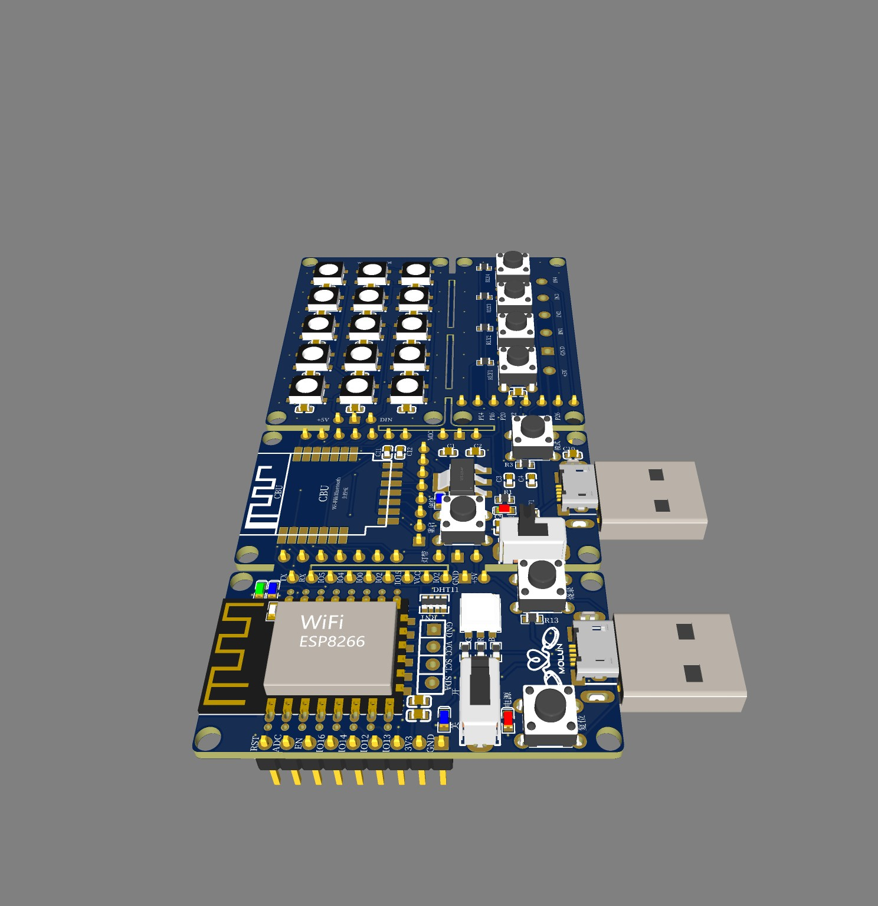
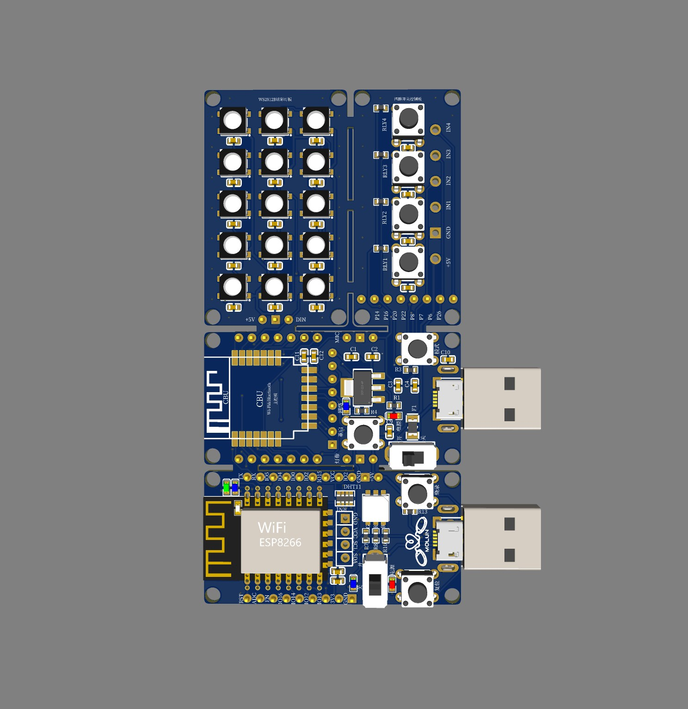
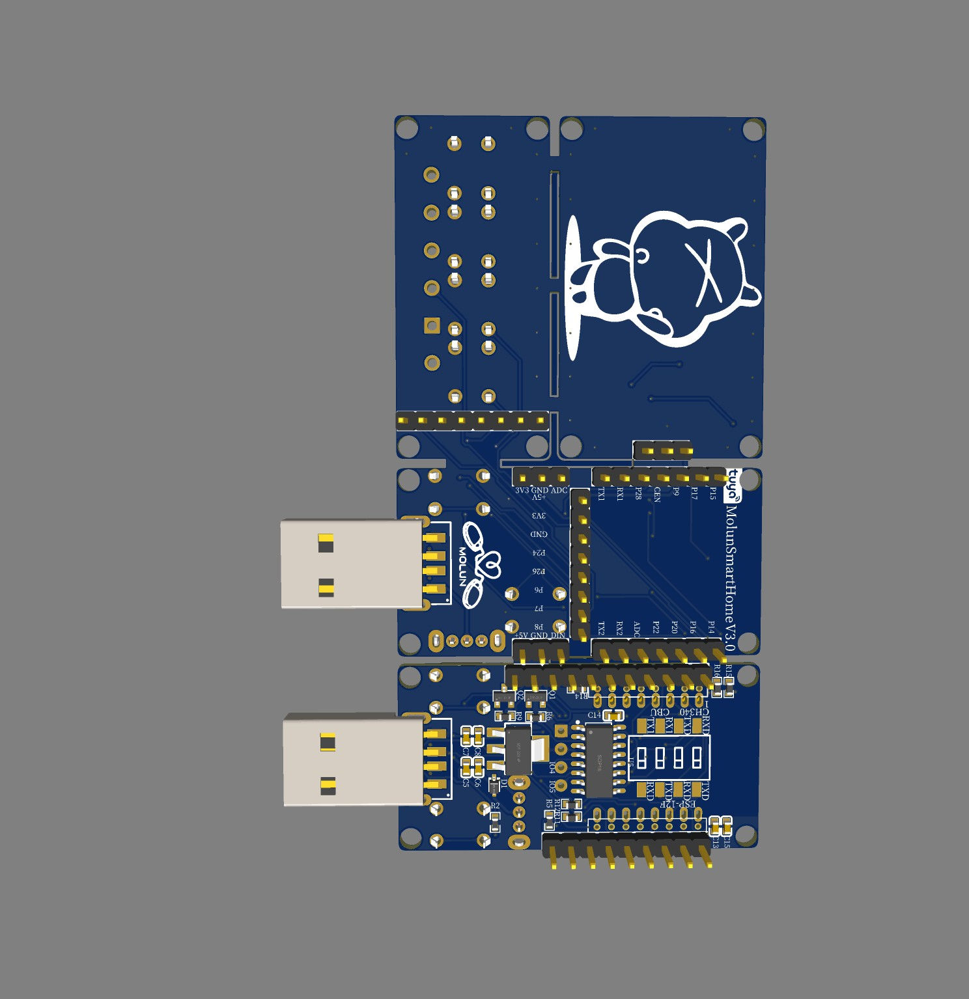
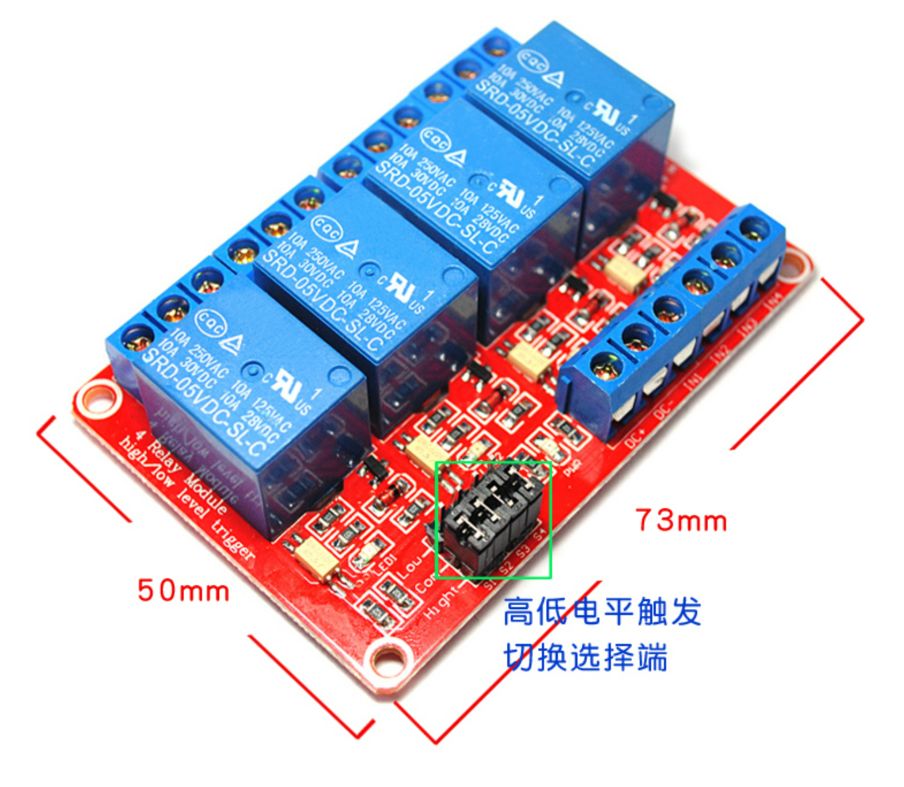

# MolunSmartHomeKits

This project is developed using Tuya SDK, which enables you to quickly develop branded apps connecting and controlling smart scenarios of many devices.

For more information, please check Tuya Developer Website.

## 开发板可以组合使用，也可单独使用。
涂鸦CBU Wi-Fi&Bluetooth 模组转接板，可直接用于SOC免开发炫彩灯（WS2812B），也可以使用通用模组固件对接到MCU（Arduino开发板、ESP8266等）实现更为丰富的功能！

- 开发板焊接四路开关CBU模块，搭配四路继电器模块，可以实现四路开关控制！
- 开发板焊接免开发灯带CBU模块，可以实现WB2812B灯板控制，同时可以搭配MIC模块实现本地音乐律动。
- 开发板焊接通用固件CBU模块，ESP-12F可充当MCU，实现Arduino编程接入涂鸦IOT。

