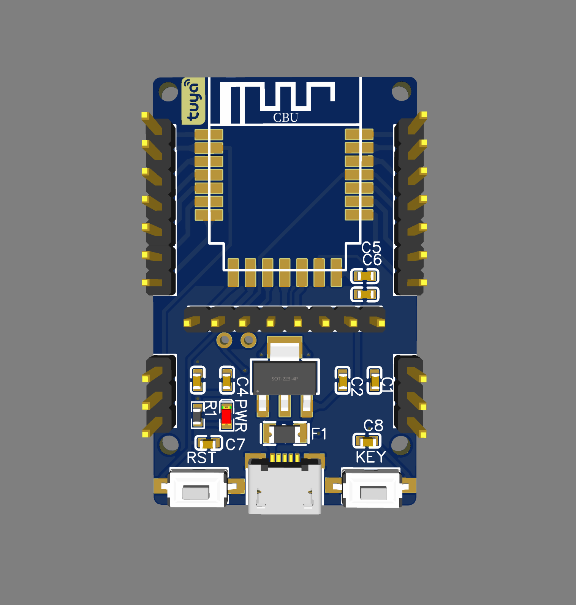
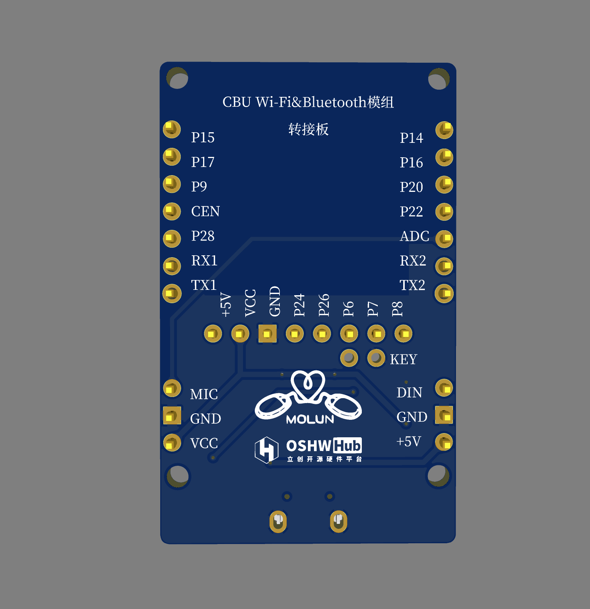
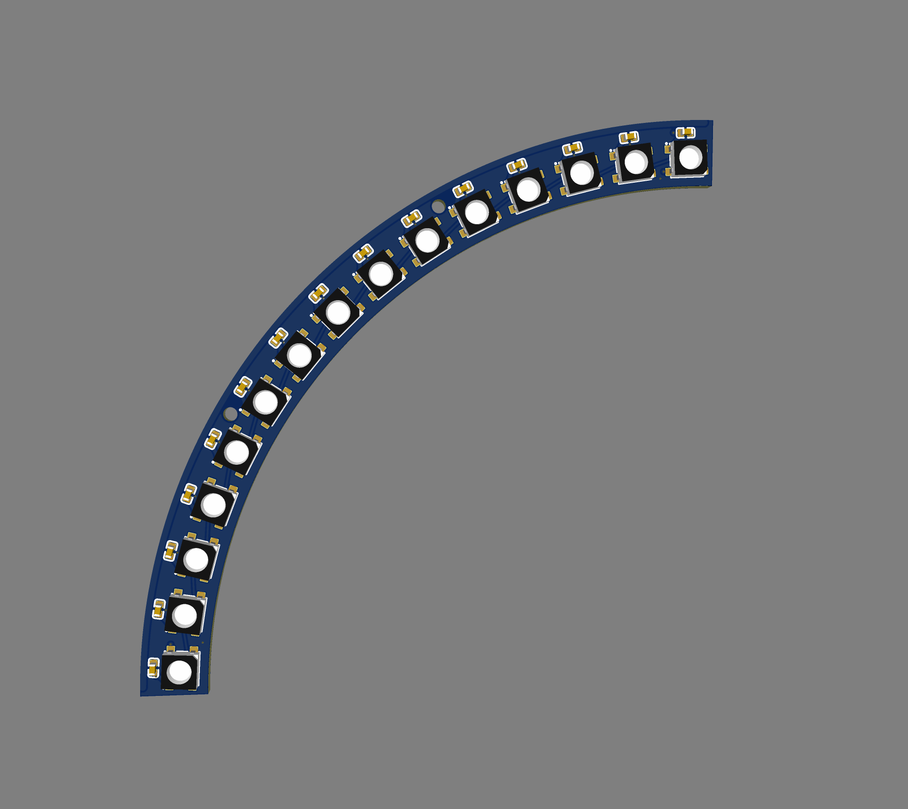

# MolunSmartHomeLights
This project is developed using Tuya SDK, which enables you to quickly develop branded apps connecting and controlling smart scenarios of many devices.

For more information, please check Tuya Developer Website.

涂鸦CBU Wi-Fi&Bluetooth 模组转接板，可直接用于SOC免开发炫彩灯（WS2812B），也可以使用通用模组固件对接到MCU（Arduino开发板、ESP8266等）实现更为丰富的功能！

KEY按键可以通过焊盘短接连接到P6，也可以通过焊盘飞线连接想要的IO口实现控制。F1自恢复保险不接时，请直接短接焊盘。
转接板预留MIC模块接口，可以实现本地音乐律动！

